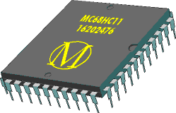

**This repository has been displaced by the newer and more functional [Generic Code-Seeking Diassembler with Fuzzy-Function Analyzer](https://github.com/dewhisna/gendasm), which has all of the same functionality of this disassembler, plus adds other processors (like the AVR family) and has a functioning Fuzzy-Function Analyzer.**

Description
-----------

The M6811 Code-Seeking Disassembler is a command-line tool that lets you enter known starting vectors for a given code image for the 6811 micro. It will disassemble the code and follow through branches to assist in the separation of code and data.

Its companion Fuzzy Function Analyzer uses DNA Sequence Alignment Algorithms to locate similar code in multiple binaries, facilitating reverse-engineering.

Originally written to analyze code from GM automotive engine controllers, but is useful anywhere a 6811 micro is being used.

Version 1.0 was written in Borland Pascal in April 1996, and updated to v1.2 in June 1999. It was later rewritten to C++ in July 1999 through Jan 2000.

While it's been freely available since its creation, it's being released here as an open-source project so the world can better use it as it sees fit.

Version 2.0 is completely reworked in 2014 to compile and run with GCC and STL to make it fully portable and accessible to all computer platforms.

License
-------

M6811DIS Code-Seeking Disassembler

Copyright (C) 1996-2015 Donna Whisnant, a.k.a. Dewtronics.

Contact: <http://www.dewtronics.com/>

